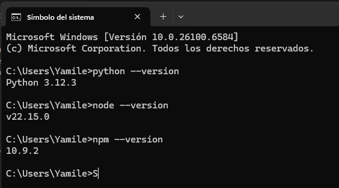
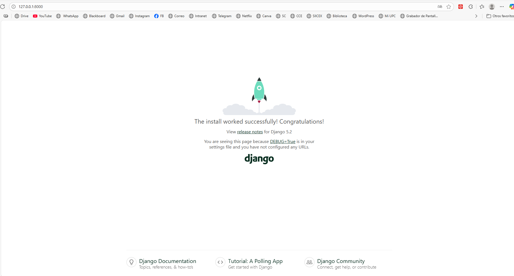
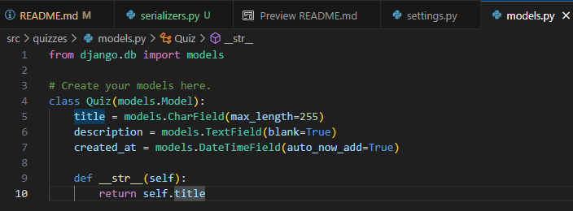
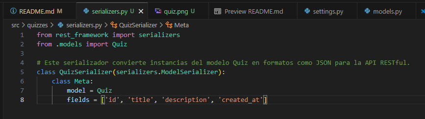
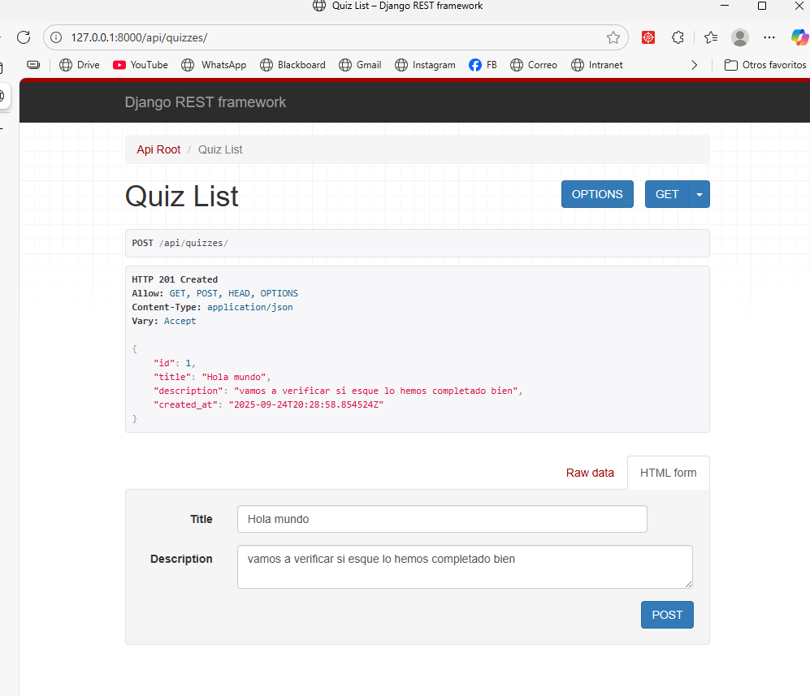

# 📝 QuizzIA

QuizzIA es una aplicación de cuestionarios interactivos desarrollada como parte de la guía del curso.  
Este proyecto utiliza **Django** para el backend y **Node.js** para la gestión de dependencias/front-end.

---

## 🔧 Requisitos previos

Antes de comenzar, asegúrate de tener instalado en tu sistema:

- **Python 3.x**
- **Django** (última versión estable)
- **pip** (administrador de paquetes de Python)
- **Entorno virtual (venv)** para aislar dependencias
- **Node.js** (con npm o yarn)

---

## 🐍 Versión de Python

Para confirmar la versión de **Python** instalada en el sistema, ejecuta en la terminal:

```bash
python --version
```

---

## 🌐 Versión de Node.js

Para confirmar la versión de **Node.js** instalada en el sistema:

```bash
node --version
```

Para confirmar la versión de **npm** (administrador de paquetes de Node.js):

```bash
npm --version
```

## Evidencia



---

## 📂 Crear proyecto en Django

Primero crea una carpeta para tu proyecto:

```bash
mkdir Django_QuizzIA
cd Django_QuizzIA
```

---

## 🛠️ Crear y activar entorno virtual

Crea un entorno virtual con:

```bash
python -m venv venv
```

Activa el entorno virtual:

**En Windows:**

```bash
venv\Scripts\activate
```

**En Linux / MacOS:**

```bash
source venv/bin/activate
```

---

## ⚙️ Instalar Django

Con el entorno virtual activado, instala Django:

```bash
pip install django
```

---

## 🚀 Crear proyecto base

Crea el proyecto principal de Django llamado QuizzIA:

```bash
django-admin startproject QuizzIA
```

Entra a la carpeta del proyecto:

```bash
cd QuizzIA
```

Ejecuta el servidor para verificar que todo funciona:

```bash
python manage.py runserver
```

## Evidencia



---

---

## 📦 Crear la app `quizzes` y el modelo `Quiz`

Creamos la app llamada `quizzes` dentro del proyecto Django:

```bash
python manage.py startapp quizzes
```

## ⚙️ Registrar la app en `settings.py`

Para que Django reconozca la nueva app, agrega `'quizzes'` a la lista `INSTALLED_APPS` en el archivo `src/config/settings.py`:

```python
INSTALLED_APPS = [
    'django.contrib.admin',
    'django.contrib.auth',
    'django.contrib.contenttypes',
    'django.contrib.sessions',
    'django.contrib.messages',
    'django.contrib.staticfiles',
    'rest_framework',  # 🆕
    'quizzes',         # 🆕
]
```

Luego, en el archivo `quizzes/models.py`, definimos el modelo `Quiz`:

```python
from django.db import models

class Quiz(models.Model):
    title = models.CharField(max_length=255)
    description = models.TextField(blank=True)
    created_at = models.DateTimeField(auto_now_add=True)

    def __str__(self):
        return self.title
```

Este modelo representa cada cuestionario, con campos para el título, descripción y fecha de creación.

---

## Evidencia



---

## 🛠️ Crear el serializer para el modelo `Quiz`

Creamos un archivo llamado `serializers.py` en la app `quizzes` y definimos el serializer `QuizSerializer` usando Django REST Framework.  
Este serializer permite transformar instancias del modelo `Quiz` en formatos como JSON, facilitando la comunicación entre el backend y clientes API.

```python
from rest_framework import serializers
from .models import Quiz

class QuizSerializer(serializers.ModelSerializer):
    class Meta:
        model = Quiz
        fields = ['id', 'title', 'description', 'created_at']
```

## Evidencia



---

## 🚦 Probar el endpoint de Quiz

Se realizó una prueba del endpoint de la API para el modelo `Quiz` y la respuesta fue exitosa, mostrando los datos correctamente en formato JSON.


